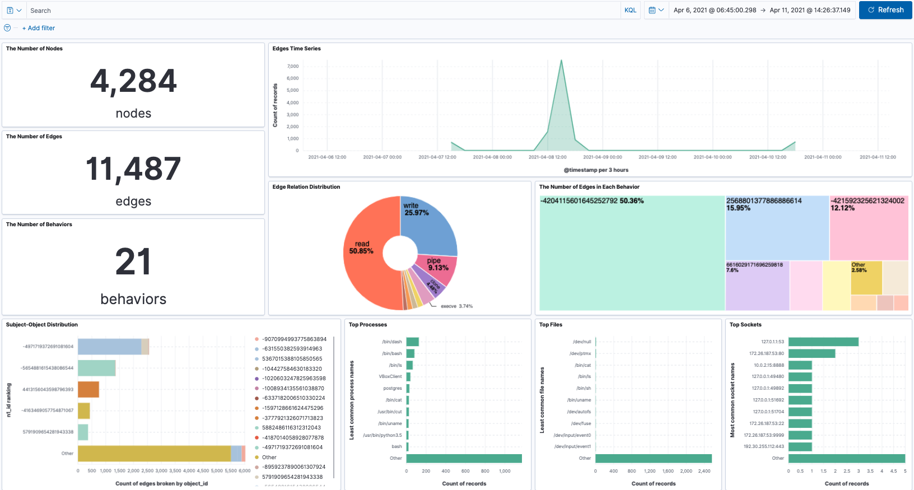

## Visualization

### Statistical-based Visualization

``Provenance Data Statistics.ndjson`` is the exported statistical-based visualization dashboard. It looks like: 

To import this dashboard template to your Kibana, open Kibana web page and go to [Stack Management] - [Saved Objects] - [Import] and import ``Provenance Data Statistics.ndjson``.

### Graph-based Visualization
``Kibana Development.md`` introduces all the details you should know about developing a Kibana plugin.

``prov_graph`` folder is the graph-based visualization plugin (for Kibana 7.13). Copy this to the kibana development directory ``kibana/plugins`` to develop. Or use the built plugin ``provGraph-7.13.zip`` to a standard Kibana release version.